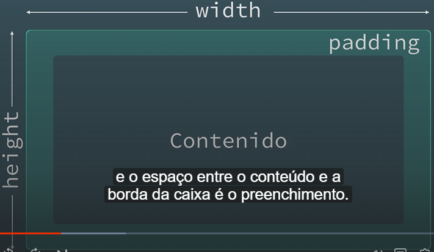

# [Introdução ao desenvolvimento de Web Responsive com HTML e CSS](https://www.domestika.org/pt/courses/74-introducao-ao-desenvolvimento-de-web-responsive-com-html-e-css)

Nossos elementos são escritos dentro de tags

"`<tag class="" id="">`

#### Atributos

são referencias para o navegador ler mais especificamente o elemento.

class="" e id=""

#### tags de texto

`<em>info</em> - Serve para deixar em itálico uma palavra ou várias e serve para dar enfase especial nesse conteúdo`

`<strong>info</strong> - Funciona como um negrito no conteúdo dentro de sua tag e serve para dar enfase especial no que está dentro`

`info  - Agrupa uma ou varias palavras de texto sem ter nenum falor semantico, é uma forma de diferenciar um conteúdo especifico para trabalhar em seu estilo de forma separada`

#### img e links

` - Importante lembrar do caminho durante a marcação de conteudo dentro das etiquetas`

``

#### Etiquetas de bloco

São tags que nos permite dar estilos e estrutura a grupos de elementos

`
 - é uma tag que não fornece nenhum valor semantico, ajuda a agrupar partes do site e atribuir a eles classes e estilos.`

Serve para maior parte da construição de estruturas de sites

`<ul></ul> - Lista não ordenada. Podem conter apenas um tipo de tag:`

`< li></li>  são os elementos de uma lista. Dentro da ul so podem haver li`

um caso comum de uso de listas estão nos links de uma navegação:

<ul>
	<li><a href="..."> Inicio</a></li> 
	<li><a href="..."> Produtos</a></li> 
	<li><a href="..."> Contatos</a></li> 
	<li><a href="..."> Blog</a></li> 
</ul>

Semanticamente, estaremos informando que esses links faz parte e um conjunto e informações específica

também temos a `<ol> - que é uma lista ordenada, onde os elementos estarão numerados`

etiquetas de documento

<html>

# CSS

seletor, outroseletor {

    propriedade: valor;

}

para anexar as camadas de estilo, precisamos trazer esse link para dentro do html com uma chamada da tag `<link>, vamos ver algumas formas de interagir e estilizar conteudos que estão em diversas no conteudo html:`

Seletor direto:

""`
` um paragrafo `
`""

p{color: purple;}

---

Conteudo a partir de class:

""`
`

    `
`""

.container{color:purple;}

---

class dentro de div:

""`
`

    `
`

""
`
`""

div.principal{color:purple;}

---

Afetar um conteúdo dentro de uma div:

""`
 `

`

`

`
""`

.principal p{propriedade:valor}

---

seletor universal, atingindo todo documento:

\*{

propriedade:valor}

#### Estilos tipograficos

font-size: altera o tamanho da fonte de um seletor

font-weight: altera o peso da fonte

font-style: altera a versão cursiva da tipografia

text-decoration: altera a propriedade decorativa da fonte

line-height: propriedade de altura de linha, com base no tamanho da fonte

color: determina a cor da fonte, podendo ser uma palavra em ingles, podendo ser em hexadecimal #rrggbb ou rgb com rgb(r,g,b) e o rgba(r,g,b,a)

## Especificidades e estrutura em CSS

Organizar as folhas de estilo é essencial para evitar erros e corrigi-los no futuro.

1. Quanto mais especifica for a afirmação de seletor no CSS, mais importancia ele terá e não será substituido.

---

## Pseudoclasses

- Se referem a mudança de estado de um elemento
- Podem ser mudanças ao interagir com o usuario

São identificados com ":", ex: "

a:hover{
text-decoration: line-through
}"

São propriedades que informam como um elemento irá se comportar ao intergir de acordo com o sufixo utilizado.

## Modelo de Caixa

height --> Altura

width --> Largura

Padding --> espaço entre conteúdo e a borda, como um preenchimento

margin --> espaço fora dda caixa e em relação a caixa é a margem
